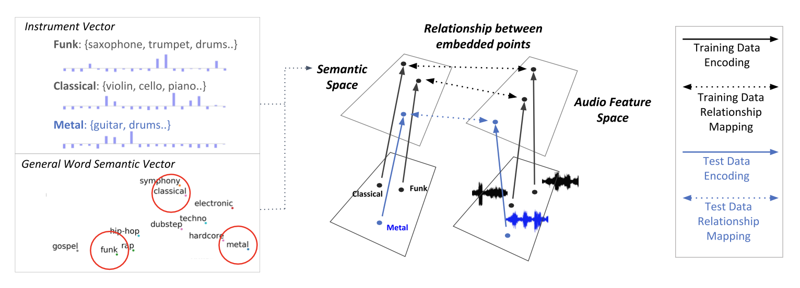

# Classification: Music Classification and Tagging

## Zero-shot Learning for Audio-based Music Classification and Tagging
Zero-shot learning paradigm has been adapted to the music tagging task where the model predicts musical categories or attributes such as genre, mood, instruments and other song quality from audio. It is aimed to overcome the limitation of the supervised learning setup that allows only a fixed set of word labels.
By constructing the connection between general semantic space of human language and the music audio embedding space, a zero-shot music tagging model can make predictions towards newly added music genres or semantic words that users arbitrarily choose for music retrieval. 

### Data split proposal for multi-label zero-shot evaluation
They also proposed a more systematic zero-shot learning split for multi-label classification tasks in order to be more clear and refined on the scope of information the model can access during training. 
Most works beforehand on multi-label zero-shot learning are conducted the instance-first split. They first split instances into train and test, and only used seen labels for training. In this case, some of the instances in the train set can have positive annotations for unseen labels. The label-first split where labels are first split into seen and unseen groups, training instances that have no positive annotation for unseen labels are selected and test instances that have at least positive annotation on unseen labels are selected. However, in this case, from the nature of multi-label data, too many instances are assigned to the test set.

 

The proposed split first divide labels into seen (X) and unseen (Y) groups and then split instances into three groups. The first subset (A) of instances are labeled with at least one from seen labels and not labeled with any of unseen labels. The second subset (B) of in-stances are labeled with at least one from each of seen and unseen labels. Lastly, the third subset (C) of instances are only labeled with at least one from unseen labels. They conduct zero-shot learning experiments on different combinations of the splits that varies in the strictness of the zero-shot paradigm where many aspects of multi-label zero-shot learning can be considered. Note that B, C, or (B+C) with (X+Y) evaluation is the multi-label version of generalized zero-shot evaluation.

# Recent advances on zero-shot music tagging

## Contrastive Audio-Language Learning For Music (2022)

## MuLan: A Joint Embedding of Music Audio and Natural Language (2022)

