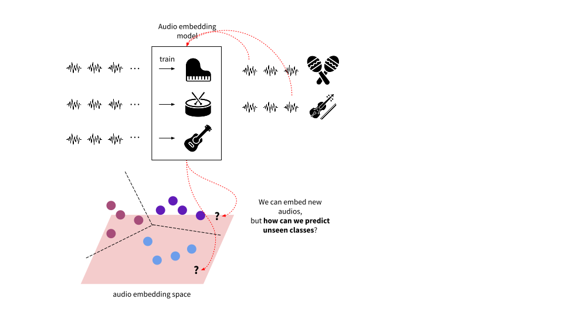
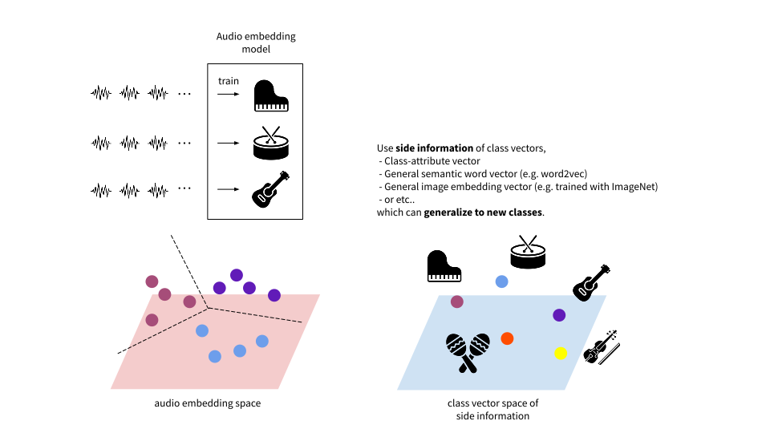

# Zero-Shot Learning Foundations

Zero-shot learning is yet another approach for classifying the classes that are not observed during training. Main difference from few-shot learning is that it does not require any  additional data for novel class inputs. 
Therefore, in zero-shot learning, there is no further training step for unseen classes. Instead, during the training phase, the model learns how to use the side information that can potentially cover the relationship between any of both seen and unseen classes. After training, it can handle the cases where inputs from unseen classes are to be classified.

Zero-shot learning paradigm was initially proposed and explored in computer vision field. It is again closely related to the concept of knowledge transfer. 

## Setting up zero-shot learning models

### Zero-shot learning task

This is enabled by utilizing auxiliary information that provides a separate semantic space of label classes.

 <!-- Broad concept of zero-shot learning is shown on the figure below. By unveiling relationship between this semantic space and the media feature space (e.g. audio feature space), it is possible to either map vectors from one space to the other or derive a new joint embedding space where vectors from both spaces can be projected. After training this projection, any newly added audio or labels can be projected on a single space where their similarity measures are calculated to conduct classification task.  -->

Let's look into a case of an audio-based instrument classication task. First, given training audio and their associated class labels (seen classes), we train a classifier that projects input vectors onto the audio embedding space. 

However, there isn't a way to make prediction of unseen labels for unseen audio inputs yet.

As forementioned we use the side information that can inform the relationships between both seen and unseen labels. There are various sources of the side information, such as class-attribute vectors infered from an annotated dataset, or general word embedding vectors trained on a large corpus of documents. We will go over in detail in the later section.  

The core of zero-shot learning paradigm is to learn the compatibility function between the embedding space of the inputs and the side information space of their labels. 
- Compatibility function : $F(x, y ; W)=\theta(x)^T W \phi(y)$
    - $\theta(x)$ : input embedding function.
    - $W$ : mapping function. 
    - $\phi(y)$ : label embedding function.

A typical approach is to train a mapping function between the two.

After training, arbitrary inputs of unseen labels can be predicted to the corresponding class. 

Another option is to train a separate zero-shot embedding space where the embeddings from both spaces are projected (a metric-learning approach).

- E.g. Training mapping functions $W_1$ and $W_2$ with a pairwise loss function : $\sum_{y \in \mathcal{Y}^{seen}}\left[\Delta\left(y_n, y\right)+F\left(x_n, y ; W_1, W_2\right)-F\left(x_n, y_n ; W_1, W_2\right)\right]_{+}$
    - where $F(x, y ; W_1, W_2)= \text{Distance}(\theta(x)^T W_1, \phi(y)^T W_2)$

In this case, the inputs and the classes are projected onto another zero-shot embedding space.

