# Side Information

We will now go over the broad categories of side information (attribute-based, term or description-based, and etc.) and look through specific examples from three different domains (computer vision, language, and audio). Since zero-shot learning has been mainly studied in computer vision domain, there are relatively more benchmark datasets available for the image classification task. However, we seek to discuss the future direction of music-related zero-shot learning datasets by going over the formation of image-related ones.

# Types of Side information 
## (1) Class-Attribute relationship

The first type of side information bases on the class-attribute relationships. Using the attribute information, we can build the vector representation of a class, which can be further put into the zero-shot learning framework. 

In computer vision domain, multiple attribute-annotated image class datasets are available. 
- Animals with Attributes dataset
    - Image annotations of 50 different animal classes with 85 labeled attributes.
    - 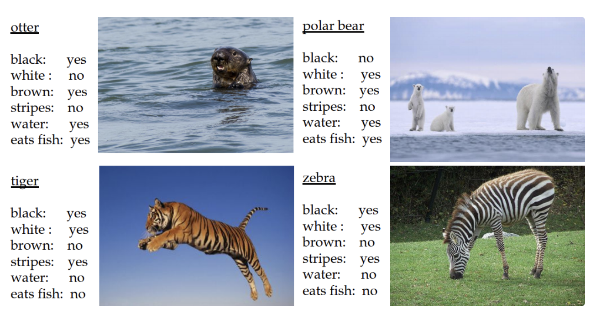
<!-- - Attributes Pascal and Yahoo dataset
    - Image annotations of 32 classes annotated with 64 binary attributes, covering shape and material as well as object components.
    - 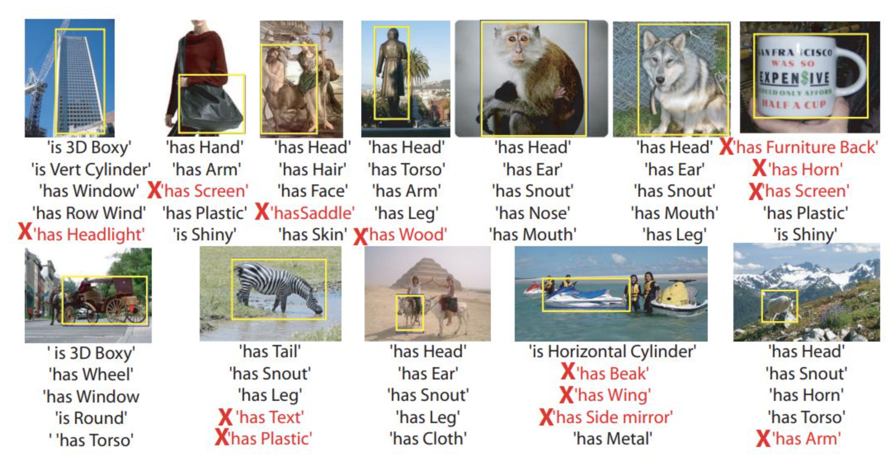 -->
- Caltech-UCSD Birds 200 Dataset
    - Image annotations of 200 bird species with a bounding box, a rough bird segmentation, and a set of attribute labels.
    - 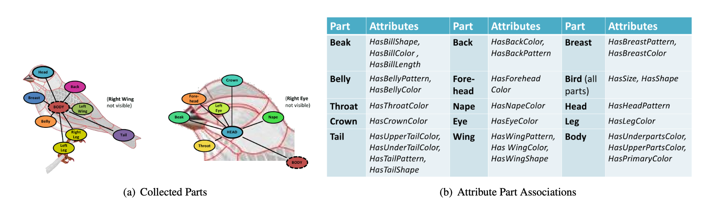

In music domain, there aren't many datasets containing the human annotated class-attribute relationship. However, we can find an example that has combined two labeled music datasets, OPEN-MIC 2018 and Free Music Archive (FMA) to formulate statistical instrument attribute scores for each genre class.
- Instrument-genre dataset : OPEN-MIC 2018 instrument annotation combined with FMA genre annotations.
    - 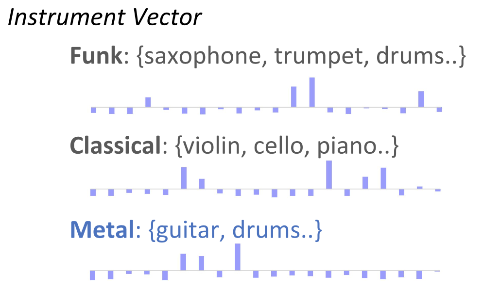 
    - Audio annotations of 157 genre labels with each genre annotated with likelihood measures of 20 instruments.
        - FMA contains audio files and genre annotations. OpenMIC-2018, which was originally designed for multiple instrument recognition, has 20 different instrument annotations to the audio files in FMA.
        
## (2) Class as a textual datapoint 

Since the label classes themselves are in a textual form, information retrived from various textual sources can also be used as the side information.

For example, Wordnet hierarchy provides the general semantic relationship between words and the articles in Wikipedia provide the detailed description of each class label. 
We can also conjugate a general word embedding space trained with a large textual corpus (Word2vec or GloVe), and this can be extended to more sophisticated modern language models such as BERT. 

### General word semantic spaces

1. Word-level semantic spaces.
    - WordNet 
        - 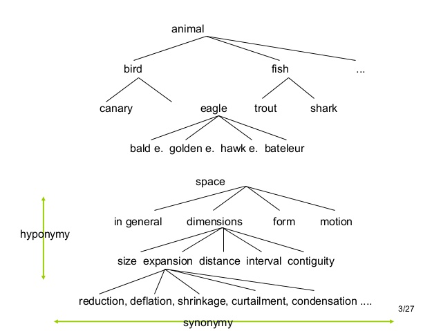 
    - Word2Vec-like embeddings
        - 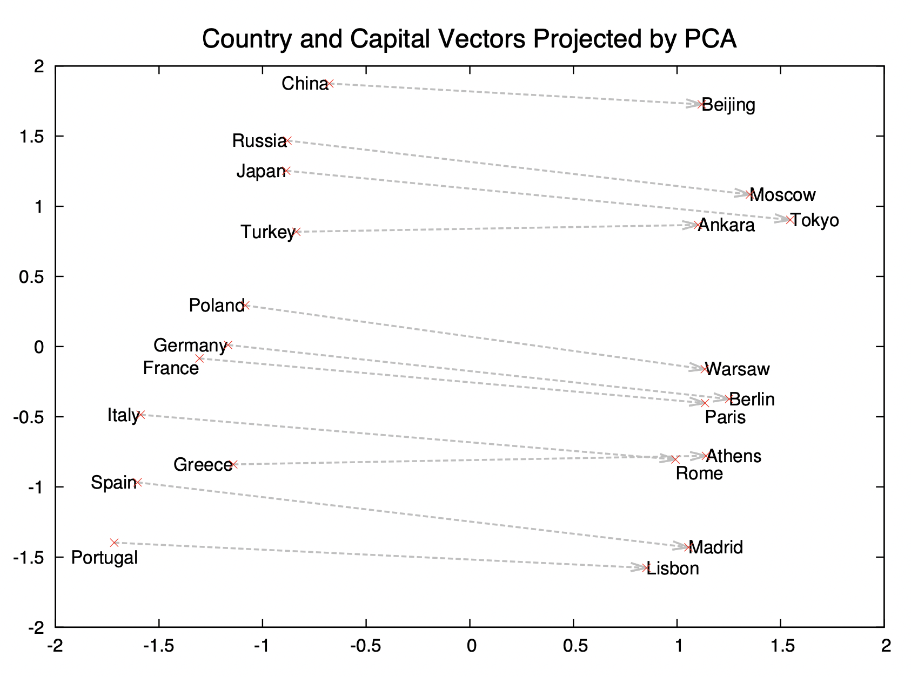 
2. Description-level semantic spaces.
    - BERT or other variants of the Masked Language Model (MLM).
        - 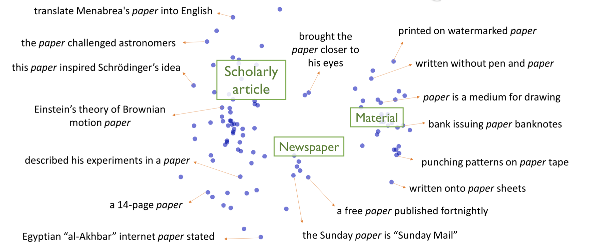 
    
### Music with textual annotations

In music domain, following resources have been used for the zero-shot genre or tag classification experiments.
1. Music audio with tag annotations.
    * Free Music Archive (FMA) dataset of genre annotations.
    * Million Song Dataset (MSD) with the Last.fm tag annotations filtered with Tagtraum genre/sub-genre ontology (audio not available in public).
    * MSD with the Allmusic tag annotations : music tags (genre, style) and context tags (mood and theme).
    * AudioSet (music related portion) of class annotations. 
    * MagnaTagATune (MTAT) dataset of tag annotations.
    * MuMu dataset (MSD with the Amazon album reviews and metadata) : customer reviews and metadata on music albums gathered from Amazon.com.
2. Textual descriptions for tags.
    * Wikipedia.

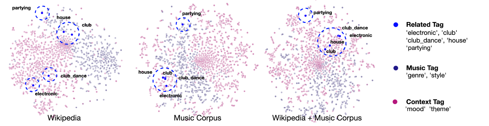 

3. Audio with direct textual descriptions.
    * Music description dataset (production music library), Contrastive Audio-language Learning for Music, Manco et al., 2022
    * Music and textual annotations assembled from a large corpus of internet music videos and their metadata, comments, and playlist titles, MuLan: A Joint Embedding of Music Audio and Natural Language, Huang et al., 2022

<!--     
- Description-level semantic spaces.
    - Sentence or paragraph 
        - “Predicting Deep Zero-Shot Convolutional Neural Networks using Textual Descriptions” 
            - uses textual description from wikipedia (tf-idf feature) → classify unseen categories from their textual description 
                - 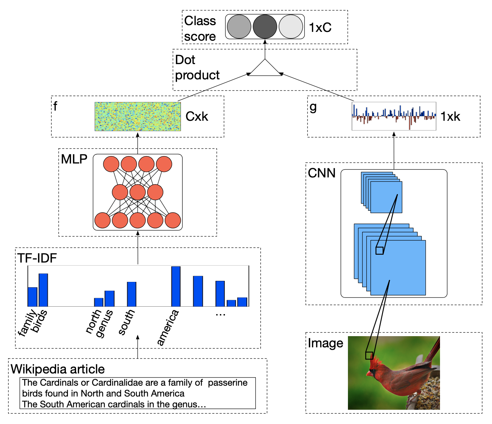 
        - Prompt-based learning 
            - CLIP
                - 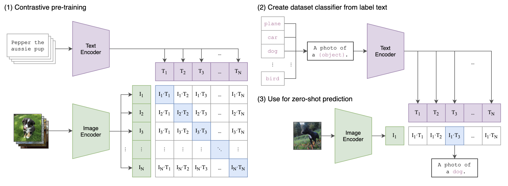 
            <!-- - Dall-e 2
                - 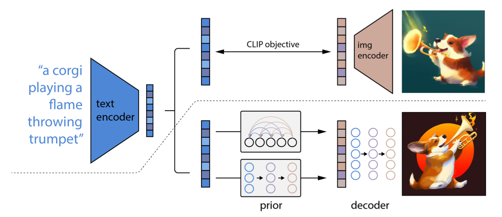  -->
        

## (3) Class attributes from other modalities. 

### Annotated music with other available modalities

1. Music audio with instrument annotations and images.

2. Music audio with tag annotations and album cover images
    
<!-- ## (3) Other Approaches 

### Relative Attributes 
- Learning relative attributes from data (compound attributes instead of binary ones) 
    - **CV domain**
        - 'Comparative object similarity for improved recognition with few or no examples' 
            - human annotator ->  “general similarity” / “aspect based similarity”
            - 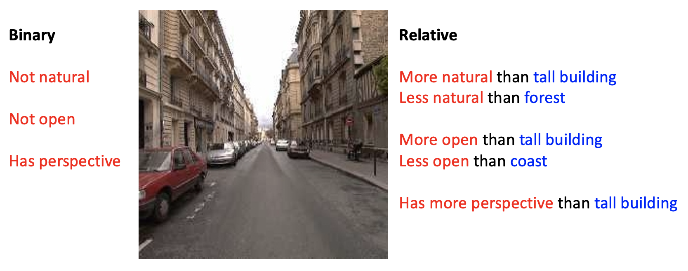 
        - 'relative attribute' paper : 
            - * ranking function (learning to rank) per attributes → relative strength of each properties per in novel image (‘bears are furrier than giraffes’ )
            - a generative model over the joint space of attribute ranking outputs  
            -  
        - End-to-end localization and ranking for relative attributes
            - 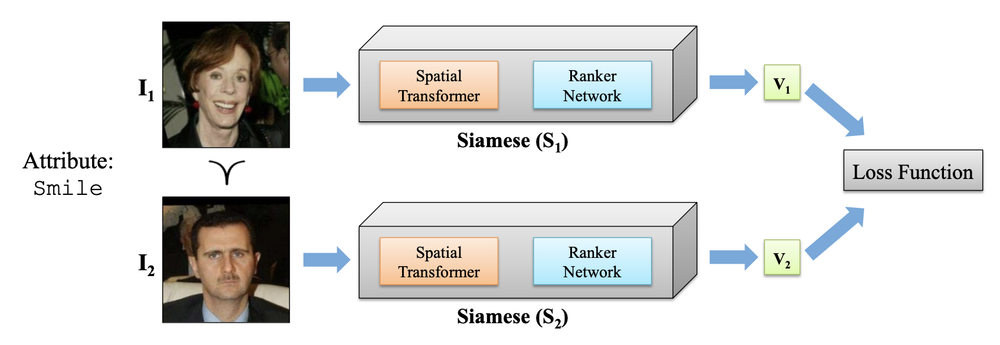 
    - **Music domain**

### Spotting or generating attributes
- Attention based attribute spotting
    - **CV domain**
        - 'Attribute Prototype Network for Zero-Shot Learning'
            - 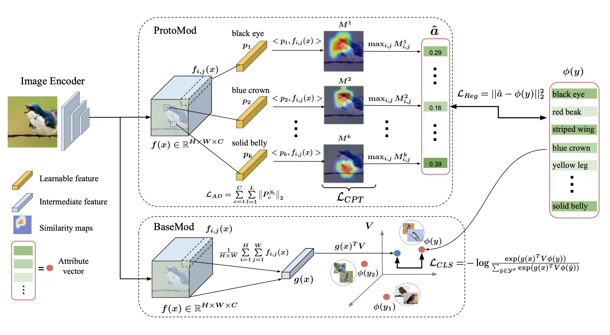 
        - 'Attentive region embedding network for zero-shot learning'
    - **Music domain**

- Generating (e.g. using GAN)
    - **CV domain**
        - 'Leveraging the Invariant Side of Generative Zero-Shot Learning'
        - 'Feature Generating Networks for Zero-Shot Learning'
    - **Music domain** -->
